Lecture #1:
========================================================================================================================================================================
# Java Web & Distributed Applications - Servlet Foundation
---

## 🧱 Types of Applications Built Using Java

### 1. Standalone Applications (JSE)
- Command-Line Interface (CUI) Applications  
- Graphical User Interface (GUI) Applications

### 2. Enterprise Applications (JEE and Frameworks)
- Web Applications  
- Distributed Applications

---

## 🔍 Web vs Distributed Applications

### 🌐 Web Applications
- **Definition:** Server-side applications designed **without** distributing logic across multiple JVMs.
- **Technologies:** CGI, Servlet, JSP  
- **Goal:** Generate **dynamic response** for web clients via browsers.  
- **Execution Environment:** Requires a **Web Server** (e.g., Tomcat, Jetty)  
- **Client Type:** Web Clients (browsers)

### 🤝 Distributed Applications
- **Definition:** Server-side applications with logic **distributed** over multiple JVMs.
- **Technologies:** RMI, EJBs, Web Services  
- **Goal:** Enable communication between local and remote machines (e.g., B2B model)  
- **Execution Environment:** Requires an **Application Server**  
- **Client Type:** Any client (not just browsers)

---

## ⚙️ Web Server vs Application Server

| Feature                | Web Application           | Distributed Application       |
|------------------------|---------------------------|-------------------------------|
| Technology             | Servlet, JSP              | RMI, EJB, Web Services        |
| Execution              | Web Server (e.g., Tomcat) | Application Server            |
| Model                  | Client to Server          | Business to Business          |
| Scope                  | Browser-based             | Any remote service-based      |

---

## 🖥 Web Programming: Static vs Dynamic Responses

### 📄 Static Response
- Same for all users and times.  
- Example: Gmail login page, ICICI homepage.

### ⚡ Dynamic Response
- Varies per user or time.  
- Example: Gmail inbox, bank balance info.

---

## 🌐 Static Response Flow (HTML)
1. Client requests static file (HTML/CSS).
2. Webserver checks resource availability.
3. Responds with file or 404 error.

> **Note:** No server-side processing needed for static files.

---

## 🚀 Dynamic Response Flow (Servlet/JSP)
1. Client sends request to Webserver.
2. Webserver checks resource type (static/dynamic).
3. For dynamic:
   - Webserver forwards to **WebContainer**.
   - WebContainer executes helper app (Servlet/JSP).
   - Response sent back to client.

> **Error Handling:**
- Missing resource → 404  
- Runtime error → 500

---

## 💡 Why Servlet over CGI?

| Feature       | CGI                          | Servlet                          |
|---------------|------------------------------|-----------------------------------|
| Language      | C (Process-based)            | Java (Thread-based)              |
| Resource Use  | Heavy (new process per request) | Lightweight (new thread per request) |
| Scalability   | Poor                         | High                             |
| Performance   | Low                          | High                             |

---

## 💡 Why JSP over Servlet?

| Feature               | Servlet                           | JSP                            |
|------------------------|------------------------------------|---------------------------------|
| Skill Requirement      | Java knowledge required            | HTML/Design skills sufficient  |
| Focus Area             | Business Logic                     | Presentation Logic             |
| Code Compilation       | Manual (requires reload)           | Auto-compiled                  |
| MVC Placement          | Controller                         | View                           |
| Separation of Logic    | Not clearly separated              | Clearly separated              |

---

## 🧰 Web Server: Apache Tomcat

### 📌 Architecture
- **Tomcat:** Provided by Apache Foundation  
- **Web Container:** Manages and executes Servlet & JSP  
  - **Catalina:** Servlet container  
  - **Jasper:** JSP container  

### 🖱 How to Start
- Navigate to `bin/` folder in Tomcat.
- Run `tomcat9.exe`
- Access via: [http://localhost:9999](http://localhost:9999)

---

## 📚 Servlet API Overview

### Packages:
- `javax.servlet.*`  
- `javax.servlet.http.*`

### Key Interfaces / Classes

| Package               | Component                       | Description                          |
|------------------------|----------------------------------|--------------------------------------|
| `javax.servlet`        | `Servlet`, `GenericServlet`, `ServletConfig`, `ServletContext`, `RequestDispatcher`, `ServletRequest`, `ServletResponse` | Core Servlet interfaces              |
| `javax.servlet.http`   | `HttpServletRequest`, `HttpServletResponse`, `HttpSession`, `HttpServlet` | HTTP-specific components             |

---

## 🔎 Sample Interface: Servlet

```
public interface javax.servlet.Servlet {
  void init(ServletConfig config) throws ServletException;
  ServletConfig getServletConfig();
  void service(ServletRequest req, ServletResponse res) throws ServletException, IOException;
  String getServletInfo();
  void destroy();
}
```
Lecture #2:BIG-7 Methods and Servlet Basics
============================================================================================================================================================================
```
What is the difference between GET and POST request types?

+-----------------------------+-----------------------------------------------------------+------------------------------------------------------------+
| Feature                    | GET Request                                               | POST Request                                               |
+-----------------------------+-----------------------------------------------------------+------------------------------------------------------------+
| Purpose                    | Retrieve information from server                          | Send data to server (e.g., insert/update)                  |
| Data in URL                | Yes, data is in URL as query string                       | No, data is sent in the request body                       |
| Example                    | /test?source=blr&dest=shivamogga                          | /test (data hidden in body)                                |
| Security                   | Less secure (data visible in URL)                         | More secure (data not visible in URL)                      |
| Data Size Limit            | Small amount (due to URL length limit)                    | Large amount of data supported                             |
| Bookmarking/Caching        | Supported                                                 | Not supported                                              |
| Idempotent                 | Yes                                                       | No                                                         |
| Safe                      | Yes                                                       | No                                                         |
| Use Case                  | Read operations like search/query                         | Write operations like uploading, submitting forms          |
+-----------------------------+-----------------------------------------------------------+------------------------------------------------------------+

NOTE:
-----
- **Idempotent Request**: If repeating the request multiple times doesn't change the result.
  → GET is idempotent, POST is not.

- **Safe Request**: If repeating the request doesn't affect server state.
  → GET is safe, POST is not.


HOW TO SEND REQUESTS
---------------------

Send GET Request:
-----------------
1. Type the address in browser URL bar and press Enter.
2. Click a hyperlink:
   <a href=" ">CLICK HERE</a>
3. Submit a form using method="GET":
   <form method="GET">
     <!-- form fields -->
   </form>
4. Submit a form without specifying method (default is GET):
   <form>
     <!-- form fields -->
   </form>

Send POST Request:
------------------
1. Submit a form using method="POST":
   <form method="POST">
     <!-- form fields -->
   </form>


HTTP REQUEST & RESPONSE CYCLE
-----------------------------
- When the request is sent, HTTP Protocol creates HTTPRequest object.
- Data is filled in HTTPRequest object and sent to server.
- Server processes and sends back HTTPResponse object.
- Browser receives HTTPResponse and displays result.

WEB APPLICATION STANDARD DIRECTORY STRUCTURE
--------------------------------------------
ProjectName/
│
├── WEB-INF/
│   ├── web.xml               --> Deployment descriptor
│   ├── classes/              --> .class files
│   └── lib/                  --> jar libraries
│
├── src/main/java/            --> .java source files
├── pages/                    --> .jsp files


HOW TO CREATE SERVLET IN JAVA?
==============================
There are 3 approaches:
a. Implementing Servlet interface
b. Extending GenericServlet (Abstract Class)
c. Extending HttpServlet (Abstract Class)


1. Servlet Interface
--------------------
public interface Servlet {
  void init(ServletConfig config) throws ServletException;
  ServletConfig getServletConfig();
  void service(ServletRequest req, ServletResponse res)
    throws ServletException, IOException;
  String getServletInfo();
  void destroy();
}

Servlet Lifecycle (performed by container):
-------------------------------------------
a. Loading                 → Static block executes
b. Instantiation           → Constructor executes
c. Initialization          → init(ServletConfig config)
d. Request Processing      → service(ServletRequest, ServletResponse)
e. De-Instantiation        → destroy()

Example:
--------
import java.io.*;
import javax.servlet.*;

public class FirstServlet implements Servlet {

  static {
    System.out.println("FirstServlet.class file is loading...");
  }

  public FirstServlet() {
    System.out.println("FirstServlet Object is instantiated...");
  }

  public void init(ServletConfig config) throws ServletException {
    System.out.println("Servlet initialization...");
  }

  public ServletConfig getServletConfig() {
    return null;
  }

  public void service(ServletRequest request, ServletResponse response)
    throws ServletException, IOException {
    System.out.println("Servlet Request Processing...");
  }

  public String getServletInfo() {
    return null;
  }

  public void destroy() {
    System.out.println("Servlet De-Instantiation...");
  }
}


2. URL Mapping (web.xml)
------------------------
<web-app>
  <servlet>
    <servlet-name>DemoServlet</servlet-name>
    <servlet-class>FirstServlet</servlet-class>
  </servlet>

  <servlet-mapping>
    <servlet-name>DemoServlet</servlet-name>
    <url-pattern>/test</url-pattern>
  </servlet-mapping>
</web-app>


3. Compile and Set Environment
------------------------------
Set path:
  set path=C:\Program Files\Java\jdk1.8\bin
Set classpath:
  set classpath=.;C:\Tomcat 9.0\lib\servlet-api.jar

Copy compiled .class file:
  → Copy to: WEB-INF/classes/

4. Start Tomcat Server:
-----------------------
Go to:
  C:\Tomcat 9.0\bin\
Run:
  tomcat9.exe

5. Send Request to Servlet:
---------------------------
Type in browser:
  http://localhost:9999/FirstApp/test
```

Lecture #3:
===========================================================================================================================================================================

**Standard Folder Structure of Webapps in Tomcat Server**

```
TomcatRoot/
|
|-- webapps/   <-- Deployment Folder
     |
     |-- SecondApp/
          |-- WEB-INF/
               |-- web.xml         <-- Deployment Descriptor
               |-- classes/
                    |-- *.class   <-- Compiled Servlet Classes
          |-- src/main/java/
               |-- *.java        <-- Source Files
```

> **Why is webapps called Deployment Folder?**

* When Tomcat starts, it scans `webapps/` and loads all the projects inside it.
* These projects are moved to the execution area (ready to serve requests).
* For each app, Tomcat creates a **ServletContext** object.
* Tomcat reads each app's `web.xml` to understand URL mappings of servlets.

---

**Sending a Request to Application**

```
http://localhost:9999/[ApplicationName]/[url-pattern]
```

**Example:** `http://localhost:9999/SecondApp/demo`

**Tomcat Request Flow:**

1. Browser sends request → `http://localhost:9999/SecondApp/demo`
2. HTTP protocol creates `HttpRequest` object based on request type.
3. Tomcat extracts context and URL pattern from request.
4. Container reads `web.xml` to locate servlet for the URL.
5. Servlet Lifecycle is executed:

```
a. Loading                -> Class c = Class.forName("SecondServlet");
b. Instantiation          -> Object obj = c.newInstance();
c. Initialization         -> obj.init(ServletConfig config);
d. Request Processing     -> obj.service(ServletRequest, ServletResponse);
e. De-Instantiation       -> obj.destroy();
```

> **ServletRequest** → Used to get input from client.
> **ServletResponse** → Used to send output to browser.

---

**First vs Second Request Output**

```
First Request:
- Loading...
- Instantiation...
- Initialization...
- Request Processing...

Second Request:
- Request Processing...
```

**Why Second Request is Faster?**

* Servlet is already loaded, instantiated, and initialized.

**How to Maintain Uniform Response Time?**
→ Use `<load-on-startup>` tag in web.xml

```xml
<servlet>
  <servlet-name>DemoServlet</servlet-name>
  <servlet-class>SecondServlet</servlet-class>
  <load-on-startup>10</load-on-startup>
</servlet>
```

> Same can be done using annotation:

```java
@WebServlet(urlPatterns="/test", loadOnStartup=10)
```

---

**Limitation of Implementing Servlet Interface**

* Must implement all methods → Code becomes lengthy.
* Hard to read and maintain.

**Solution: Use GenericServlet**

* Implements Servlet, ServletConfig, Serializable.
* Provides default implementation for all methods except `service()`.

```java
public abstract class GenericServlet implements Servlet, ServletConfig, Serializable {
    public void init(ServletConfig config) throws ServletException;
    public void destroy();
    public ServletConfig getServletConfig();
    public String getServletInfo();
    public abstract void service(ServletRequest req, ServletResponse resp);
}
```

> **Design Pattern Used**: Adapter Class Pattern

---

**init() Overloading**

```java
public void init(ServletConfig config) {
    this.config = config;
    init();  // calls overloaded init()
}

public void init() {
    // developer writes initialization logic here
}
```

> Avoid overriding `init(ServletConfig config)`
> Best practice: override `init()` only

---

**Code Example Using GenericServlet**

```java
@WebServlet(urlPatterns="/disp")
public class FourthServlet extends GenericServlet {
    public void service(ServletRequest req, ServletResponse res) throws ServletException, IOException {
        PrintWriter out = res.getWriter();
        out.println("<h1 style='color:blue;'>Writing Servlet using GenericServlet is easy....</h1>");
    }
}
```

---

**Behind the Scenes (GenericServlet Flow)**

```
=> Loading:           Loads FourthServlet.class
=> Instantiation:     Creates object
=> Initialization:    Calls init(ServletConfig) → init()
=> RequestProcessing: Calls service()
=> De-Instantiation:  Calls destroy()
```

**Which init method should devs override?** → `init()`

---

**GenericServlet Lifecycle Combinations**

1. No init() in our class:

   * GS: init(SC config)
   * GS: init()
   * US: service()

2. Only init(SC config) in our class:

   * US: init(SC config)
   * US: service()

3. Only init() in our class:

   * GS: init(SC config)
   * US: init()
   * US: service()

```
```

Lecture#4 :using HttpServlet Class:
=================================================================================================================

# **Different Ways of Creating a Servlet**

1. **Servlet (Interface)**

   * Has 5 abstract methods.

2. **GenericServlet (Abstract Class)**

   * One abstract method: `public abstract void service(ServletRequest request, ServletResponse response)`
   * Easier than implementing `Servlet` directly.

## **Why use HttpServlet if GenericServlet is easier?**

* GenericServlet processes any type of request (GET, POST...) with one `service()` method.
* Debugging becomes difficult since all requests go through the same method.
* **HttpServlet** is designed for handling HTTP-specific requests.

## **HttpServlet Methods:**

```java
public abstract class HttpServlet extends GenericServlet {
    protected void doGet(HttpServletRequest req, HttpServletResponse resp);
    protected void doPost(HttpServletRequest req, HttpServletResponse resp);
    protected void service(HttpServletRequest req, HttpServletResponse resp);
    public void service(ServletRequest req, ServletResponse resp);
}
```

**GET Request is sent when:**

* Typing URL in browser.
* Clicking hyperlink.
* Using `<form method="GET">` or default form method.

**POST Request is sent when:**

* Using `<form method="POST">`

## **Life Cycle of HttpServlet:**

1. User submits form → browser sends HTTP request.
2. Web server checks if request is static or dynamic.
3. If static: returns file or 404.
4. If dynamic: hands control to **Catalina container**.
5. Container uses `web.xml` or annotations to map URL (e.g., `/test`).
6. Checks if `TestServlet` object exists.
7. If not:

   * Loads class → static block
   * Instantiates → constructor
   * Initializes → `init()`
8. **Request Processing Phase:**

   * Container creates `ServletRequest`, `ServletResponse`
   * Calls `public void service(ServletRequest, ServletResponse)`

     * If overridden in user class → executed.
     * Else, calls `HttpServlet`'s version:

```java
public void service(ServletRequest req, ServletResponse resp) {
    HttpServletRequest hreq = (HttpServletRequest) req;
    HttpServletResponse hresp = (HttpServletResponse) resp;
    service(hreq, hresp); // Calls protected service
}
```

* `protected void service(HttpServletRequest req, HttpServletResponse resp)`

  * Checks method type:

    ```java
    String method = request.getMethod();
    if(method.equals("GET")) doGet(request, response);
    else if(method.equals("POST")) doPost(request, response);
    else return 501;
    ```

## **Method Calling Hierarchy:**

1. `public void service(ServletRequest, ServletResponse)`
2. `protected void service(HttpServletRequest, HttpServletResponse)`
3. `protected/public void doXXX()`

## **Scenarios:**

* Case 1: Only `public service(SR, SR)` → handles all request types.
* Case 2: `public service(SR, SR)` + `protected service(HSR, HSR)` → `public service()` executed.
* Case 3: `protected service(HSR, HSR)` + `doGet()` → `protected service()` executed.
* Case 4: Sending GET but only `doPost()` defined → returns 405.
* Case 5: Sending POST but only `doGet()` defined → returns 405.
* Case 6: Common method for both GET and POST:

```java
@WebServlet("/test")
public class TestServlet extends HttpServlet {
    public void doGet(HttpServletRequest req, HttpServletResponse resp) throws ServletException, IOException {
        doProcess(req, resp);
    }
    public void doPost(HttpServletRequest req, HttpServletResponse resp) throws ServletException, IOException {
        doProcess(req, resp);
    }
    public void doProcess(HttpServletRequest req, HttpServletResponse resp) throws ServletException, IOException {
        System.out.println("Method: " + req.getMethod());
        String userName = req.getParameter("username");
        System.out.println("Username: " + userName);
    }
}
```

# **Working with Request Object:**

* Retrieve single value:

  * `String getParameter(String name);`
* Retrieve multiple values:

  * `String[] getParameterValues(String name);`
* Get request type:

  * `String getMethod();`

## **Example:**

```java
@WebServlet("/reg")
public class TestServlet extends HttpServlet {
    public void doPost(HttpServletRequest req, HttpServletResponse resp) throws ServletException, IOException {
        resp.setContentType("text/html");
        String username  = req.getParameter("username");
        String useremail = req.getParameter("useremail");
        String useraddr  = req.getParameter("useraddr");
        String[] courses = req.getParameterValues("course");

        PrintWriter out = resp.getWriter();
        out.println("<html><head><title>OUTPUT</title></head><body><center>");
        out.println("<h1>Student Registration details</h1>");
        out.println("<table border='1'>");
        out.println("<tr><th>NAME</th><td>" + username + "</td></tr>");
        out.println("<tr><th>EMAIL</th><td>" + useremail + "</td></tr>");
        out.println("<tr><th>ADDR</th><td>" + useraddr + "</td></tr>");
        out.println("<tr><th>COURSE</th><td>");

        for(String course : courses) {
            out.print(course + " ");
        }

        out.println("</td></tr></table></center></body></html>");
        out.close();
    }
}
```


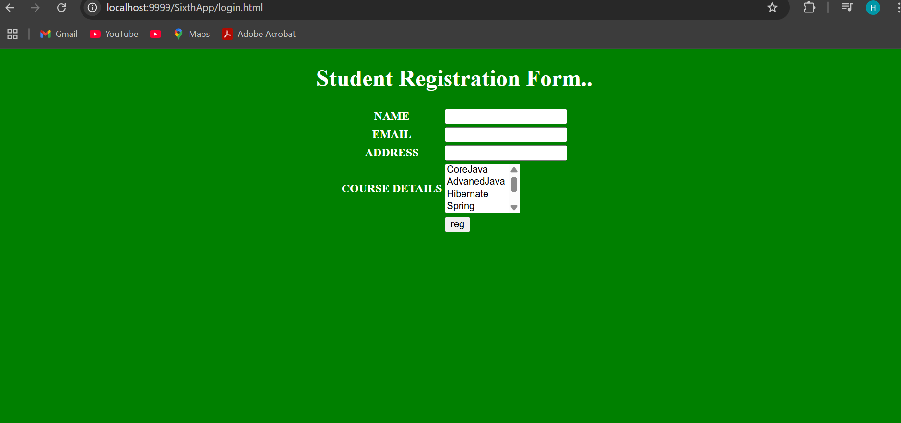
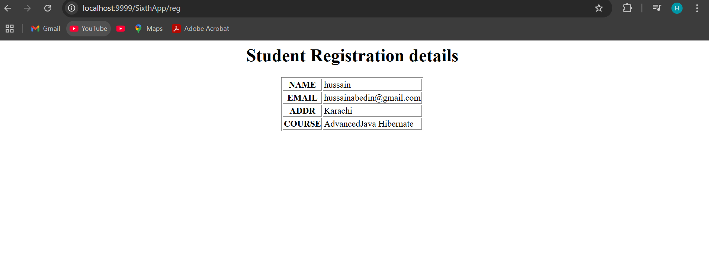

Lecture #5:
============================================================================================================================================================================

```
Different ways of Creating a Servlet
====================================

1. Servlet (I)
2. GenericServlet (AC)
3. HttpServlet (AC)

→ Dynamic response will be generated by Servlet.

Mapping a resource to particular url-pattern can be configured in two ways:
a. XML (legacy approach)
b. Annotation (Available from Servlet 3.0)

Note:
User input is sent as a QueryString from browser to protocol, and container stores it in request object.

ServletRequest(I)
    |
    |-- extends HttpServletRequest(I)

Http Request Structure:
a. RequestLine (method, resource, protocol version)
b. RequestHeader (info about client)
c. RequestBody (actual data i.e., QueryString)

Methods:
--------
public abstract Enumeration<String> getHeaderNames();
public abstract String getHeader(String keyName);

Refer: RequestHeaderApp

ServletResponse / HttpServletResponse
=====================================

1. public abstract PrintWriter getWriter() throws IOException;
   → Used to send character type response.

2. public abstract ServletOutputStream getOutputStream() throws IOException;
   → Used to send binary data (videos, images, etc.)

Note:
PrintWriter → only character data.
ServletOutputStream → character & binary data.

Q: Can we use both PrintWriter and ServletOutputStream in the same response?
A: No. It will throw:
   java.lang.IllegalStateException: getWriter() has already been called for this response.

Multithreading in Servlets:
============================
Refer: diagram...

ServletContext(I) vs ServletConfig(I)
=====================================

ServletConfig(I):
-----------------
1. Loading         → static block
2. Instantiation   → Object obj = Class.forName().newInstance();
3. Initialization  → init(ServletConfig config)

How to initialize ServletConfig:
--------------------------------
Use web.xml configuration

Example:

<servlet>
  <servlet-name>InitializationParamterApp</servlet-name>
  <servlet-class>in.ineuron.controller.InitializationParamterApp</servlet-class>
  <init-param>
    <param-name>name</param-name>
    <param-value>sachin</param-value>
  </init-param>
  <init-param>
    <param-name>age</param-name>
    <param-value>49</param-value>
  </init-param>
  <init-param>
    <param-name>address</param-name>
    <param-value>MI</param-value>
  </init-param>
</servlet>

Methods:
--------
public Enumeration<String> getInitParameterNames();
public String getInitParameter(String key);

Notes:
→ ServletConfig object is unique per servlet.
→ Stores data in key-value pairs.
→ Can be used to store DB config like:
   - url = jdbc:mysql:///octbatch
   - username = root
   - password = root123

Important:
JARs added to Eclipse are for JDK only — not available to Tomcat by default.
To make them available to Tomcat (Catalina), copy them to: /WEB-INF/lib

Refer: ServletDBCommunication

Assignment:
===========
Create a HTML form with:
- name
- age
- address

Perform insertion into DB using credentials from ServletConfig.
```

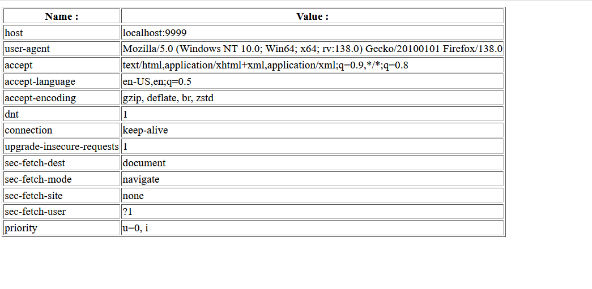
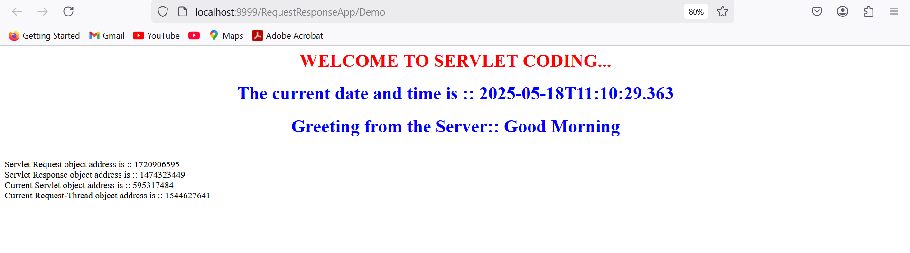

Lecture #6: Servlet Config and Servlet Context
===================================================================================================================================================================
```
1. Why there is no main method in Servlets?
===========================================

Answer:
JVM is designed to start execution from:
    public static void main(String[] args)

→ If it's a **standalone application**, JVM starts the execution.
→ But in **web applications**, the **container** handles the lifecycle:

    a. Loading
    b. Instantiation
    c. Initialization
    d. Request Processing
    e. De-Instantiation

→ Since JVM does not control servlet execution directly, we don’t need a main method in Servlets.
3. ServletConfig InitParameters
===============================

Configuration Approaches:
-------------------------
1. XML
2. Annotations

Annotation example:
-------------------
@WebServlet(urlPatterns = {}, loadOnStartup = 10,
    initParams = {
        @WebInitParam(name = "url", value = "jdbc:mysql:///octbatch"),
        @WebInitParam(name = "user", value = "root"),
        @WebInitParam(name = "password", value = "root123")
    })

Note:
- Initialization parameters are key-value pairs (both are String).
- Can only be read via getXXX(); they cannot be modified.
- They are called **"Deploy time constants"**.
- Each servlet gets one ServletConfig object.

ServletContext(I)
==================

→ For each web application, the container creates **only one ServletContext object**.

→ Used to store **application-wide configuration data**.

Q: Can we store common configuration in ServletConfig?
A: Technically yes, but not recommended. Use ServletContext for common data.

→ ServletContext can only be configured via **XML**, not annotations.

web.xml:
--------
<web-app>
  <context-param>
    <param-name>jdbcUrl</param-name>
    <param-value>jdbc:mysql:///octbatch</param-value>
  </context-param>
  <context-param>
    <param-name>user</param-name>
    <param-value>root</param-value>
  </context-param>
  <context-param>
    <param-name>password</param-name>
    <param-value>root123</param-value>
  </context-param>

  <servlet>
    ...
  </servlet>
</web-app>

Ways to access ServletContext in code:
--------------------------------------
a. ServletConfig config = getServletConfig();
   ServletContext context = config.getServletContext();

b. ServletContext context = getServletContext();

Methods:
--------
- public String getInitParameter(String name)
- public Enumeration getInitParameterNames()

load-on-startup behavior:
-------------------------
- Lower value → servlet loads first.
- Same value → container decides.
- Negative value → servlet not loaded at startup.

Difference: ServletContext vs ServletConfig
============================================

ServletContext:
---------------
a. One object per web application (application-wide).
b. Created at deployment, destroyed at undeployment.
c. Configuration via: 
   <context-param>
     <param-name>...</param-name>
     <param-value>...</param-value>
   </context-param>
d. Ways to access:
   ServletContext context = getServletContext();
   ServletConfig config = getServletConfig();
   ServletContext context = config.getServletContext();
e. Configuration only via **XML**.

ServletConfig:
--------------
a. One object per servlet.
b. Created when servlet is instantiated, destroyed when servlet is destroyed.
c. Configuration via:
   <init-param>
     <param-name>...</param-name>
     <param-value>...</param-value>
   </init-param>
d. Access via:
   ServletConfig config = getServletConfig();
e. Configuration via **XML and Annotations**.
```


Lecture #7: Scope,Parameters and Deployment Explained
=============================================================================================================================================================================

COMMONLY USED PACKAGES IN SERVLET CODING
========================================
import javax.servlet.*;
import javax.servlet.http.*;

USING THESE INTERFACES, ABSTRACTION IS PROMOTED THROUGH WHICH WODA IS ACHIEVED
==============================================================================
- ServletRequest (I)
- ServletResponse (I)
- HttpServletRequest (I)
- HttpServletResponse (I)
- ServletContext (I)
- ServletConfig (I)

LIFECYCLE METHODS IN SERVLET
============================
void init(ServletConfig config) throws ServletException, IOException
{
    // Initialization logic
}

void doXXXX(HttpServletRequest request, HttpServletResponse response) throws ServletException, IOException
{
    // request => QueryString data in the form of key-value pair
    // response => PrintWriter object to write response
}

TOMCAT IMPLEMENTATION CLASSES
=============================
- ServletConfig       => org.apache.catalina.core.StandardWrapperFacade
- ServletContext      => org.apache.catalina.core.ApplicationContextFacade
- HttpServletRequest  => org.apache.catalina.connector.RequestFacade
- HttpServletResponse => org.apache.catalina.connector.ResponseFacade

SCOPE AND ATTRIBUTE INFORMATION
===============================
Scope refers to the accessibility of a variable.

a. Local Scope   => Restricted inside a method  
b. Global Scope  => Available in all methods of a task  

TYPES OF PARAMETERS (key, value) IN SERVLET
===========================================
1. Form Parameters (QueryString)                   => request.getParameter()
2. Servlet Initialization Parameters               => ServletConfig.getInitParameter()
3. Context Initialization Parameters               => ServletContext.getInitParameter()

NOTE:
- These parameters are READ-ONLY.
- Both key and value are Strings.
- Not suitable for data sharing across components.

ATTRIBUTE TYPE (For Sharing Data)
=================================
- Key should be String
- Value can be any Object

ATTRIBUTE SCOPES IN SERVLET
===========================
1. REQUEST SCOPE
   - Maintained by: ServletRequest / HttpServletRequest
   - Starts: At request object creation (before service())
   - Ends: At request object destruction (after service())
   - Shared across components processing the same request

2. APPLICATION SCOPE (CONTEXT)
   - Maintained by: ServletContext
   - Starts: During context object creation (deployment time)
   - Ends: During context object destruction (undeployment time)
   - Shared across all components of the application (across requests and users)

PROGRAM: Display HIT COUNT (ScopeApp)
=====================================
- Maintain a counter in application scope.
- On every request, increment the count and display.

PROGRAM: Display all attribute information in Application Scope
================================================================
- Use ServletContext.getAttributeNames()
- Display key-value pairs

GETTING INFORMATION FROM THE URL
================================
1. getRequestURI()    => Full URI of the request
2. getQueryString()   => Query params after '?'
3. getServletPath()   => Mapping path of the servlet
4. getPathInfo()      => Extra path info after servlet path
5. getContextPath()   => Application root path

CODE EXAMPLE
============
package in.ineuron.controller;

import java.io.IOException;
import java.io.PrintWriter;
import javax.servlet.ServletException;
import javax.servlet.annotation.WebServlet;
import javax.servlet.http.HttpServlet;
import javax.servlet.http.HttpServletRequest;
import javax.servlet.http.HttpServletResponse;
```
@WebServlet("/test/app/*")
public class TestServlet extends HttpServlet {
    protected void doGet(HttpServletRequest request, HttpServletResponse response)
        throws ServletException, IOException {
        
        PrintWriter out = response.getWriter();
        out.println("<h1>Request URI   :: " + request.getRequestURI()   + "</h1>");
        out.println("<h1>Context Path  :: " + request.getContextPath()  + "</h1>");
        out.println("<h1>Servlet Path  :: " + request.getServletPath()  + "</h1>");
        out.println("<h1>Path Info     :: " + request.getPathInfo()     + "</h1>");
        out.println("<h1>Query String  :: " + request.getQueryString()  + "</h1>");
        out.close();
    }

}
```
REQUEST EXAMPLE
===============
http://localhost:9999/RequestAppInfo/test/app/hussain/java?name=babar&password=azam

RESPONSE
========
Request URI    :: /RequestAppInfo/test/app/hussain/java  
Context Path   :: /RequestAppInfo  
Servlet Path   :: /test/app  
Path Info      :: /hussain/java  
Query String   :: name=sachin&password=tendulkar  

DEPLOYMENT IN TOMCAT
====================
1. Hard Deployment
   - Place app inside `webapps/` folder
   - Start server manually

2. Smooth Deployment
   - App exists outside `webapps/`
   - Deployed using IDE (e.g., Eclipse integration)

NOTE:
=====
Eclipse uses smooth deployment by copying project to:
.metadata\.plugins\org.eclipse.wst.server.core\tmp0\wtpwebapps


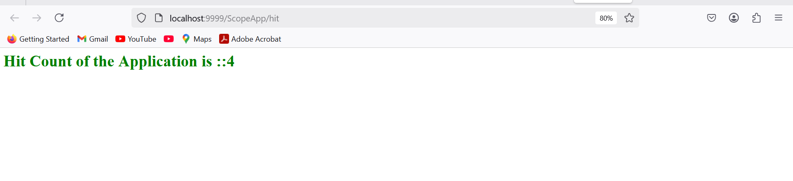


Lecture #8 : Session Tracking Mechanisms in Servlets
=========================================================================================================================================================================

# **Session Tracking Mechanism**

As a part of a web application, it is essential to manage the client's previous request data at the time of processing a later request.

**Solution 1: Usage of Request Object**

* Request object gets created when a request is sent to the application.
* It gets destroyed when the response is sent.
* Hence, it cannot retain previous client data.

**Solution 2: Usage of Context Object**

* Context object shares data across all components and all users.
* Cannot differentiate data per user.
* Not a good approach.

To manage individual client data across requests, we use **Session Tracking**, a server-side mechanism.

---

# **Session**

* Refers to the amount of time a client spends with the server.

**State of the Session**

* Data transferred between client and server through multiple requests during a session.

At application startup:

* `ServletContext` object is created.
* On request: `HttpServletRequest` object is created.
* To manage session: `HttpSession` object must be created per user.

---

# **Types of Session Tracking Mechanism**

1. HttpSession Tracking
2. Cookie Session Tracking
3. URL Rewriting
4. Hidden Form Field (Developer Specified)

*Note:* As per Sun's Servlet API specification, only the first 3 are official mechanisms.

---

# **HttpSession Tracking**

**Q: Difference between `getSession()` and `getSession(false)`?**

* `getSession()` →

  * Checks if a session exists for the user.
  * Returns existing session or creates a new one.
* `getSession(false)` →

  * Checks if a session exists.
  * Returns existing session or `null` (does not create a new one).

*Note: `getSession()` = `getSession(true)`*

**Q: How does the container identify user-specific HttpSession objects?**

* Container creates a unique session ID in Hex format (`JSessionID`).
* The ID is sent to the client via cookies.
* On next request, the browser sends back this ID to identify the session.

**Destroy Session Manually:**

```java
session.invalidate();
```

# **Limitations of HttpSession Tracking**

1. Creating server-side sessions is costly and impacts performance.
2. If cookies are disabled on the client, session tracking fails.

→ Solution: Use **Cookie Session Tracking**.

---

# **Cookie Session Tracking**

* Create a cookie for each user's request data.
* Send cookie with response object.
* Cookie is exchanged between client and server in requests/responses.

**Key Methods:**

* Create Cookie:

```java
Cookie c = new Cookie("key", "value");
```

* Retrieve Cookies:

```java
Cookie[] cookies = request.getCookies();
```

* Add Cookie to Response:

```java
response.addCookie(c);
```

**Drawbacks:**

1. If browser disables cookies, this mechanism fails.
2. Cookies are client-side, and vulnerable to tampering/misuse → security risk.

→ Solution: Use **URL Rewriting** Mechanism (next topic).


Lecture #9 :Session Tracking, URL Patterns, and Welcome Page Configuration
======================================================================================================================================================================

**Servlet API Notes**

---

### Session Tracking Mechanisms

#### 1. HttpSession Tracking

* Session ID is stored in the form of a cookie.
* If cookies are disabled in the client browser, HttpSession tracking will not work.
* Session objects are maintained at the server-side, which increases the server load.
* Example: `JSESSIONID=...DBEFH`

#### 2. Cookie Session Tracking

* Cookies are stored on the client-side.
* If cookies are disabled, we cannot track client data.
* Security risk: Since data is stored on the client, it may lead to a security breach.

#### 3. URL Rewriting

* Works similarly to HttpSession but instead of storing the session ID in a cookie, it is appended to the URL.
* Session ID is passed with each request-response.
* Example:

  ```html
  <form method="get" action='"+response.encodeURL("./second")+"'>
  </form>
  ```

  Result: `./second?JSESSIONID=...`
* **Note**: Frameworks usually support session tracking through URL rewriting.
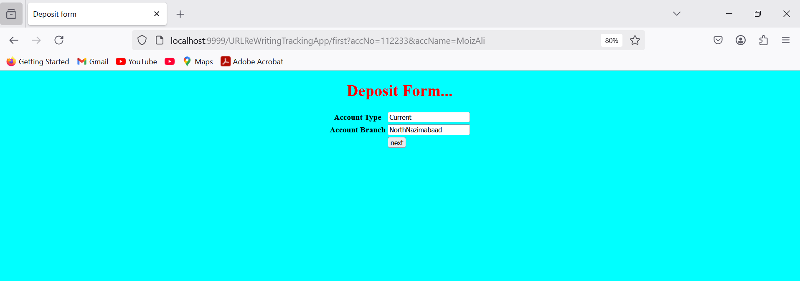

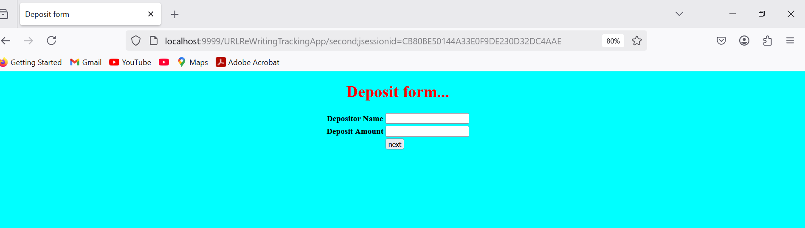

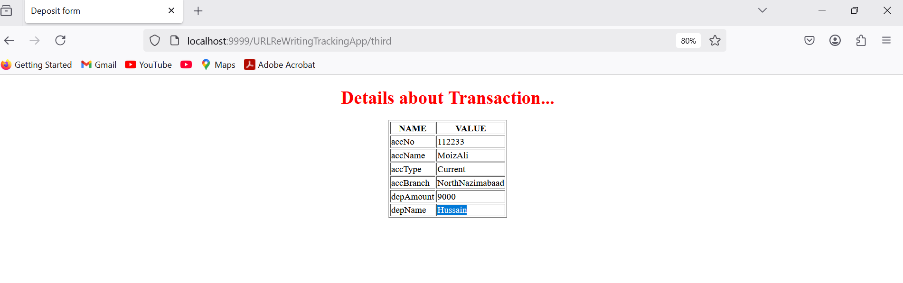

#### 4. Hidden Form Field (Developer-invented)

* Not used in real-time as it increases lines of code.

---

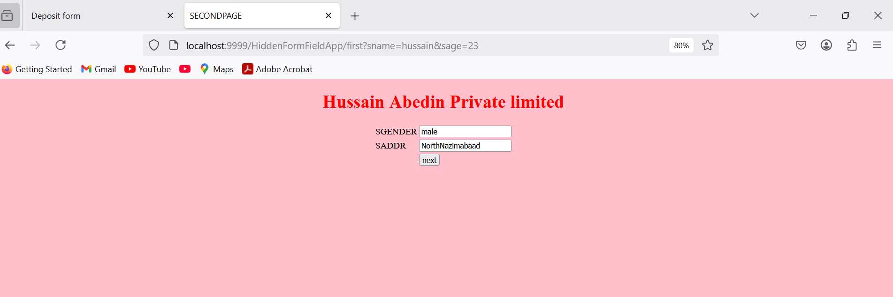

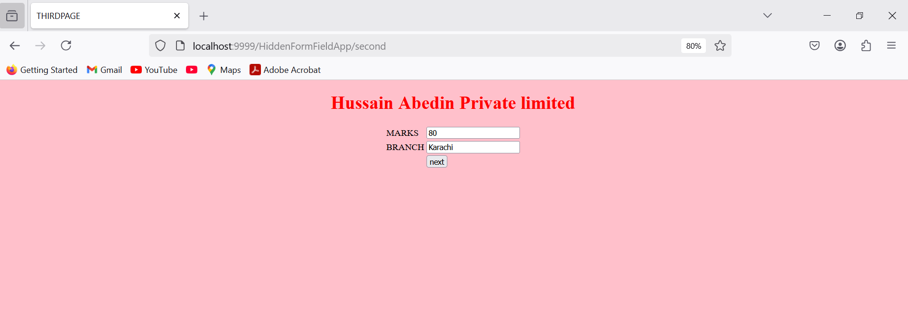


### URL Pattern Types (Servlet Mapping)

As per Servlet specification, four types:

1. **Exact Match URL Pattern**

   * Example: `/test`

2. **Longest Path Prefix URL Pattern**

   * Example: `/controller/servlet/*`

3. **URL Pattern by Extension**

   * Example: `*.do`

4. **Default URL Pattern**

   * Example: `/`

#### Valid and Invalid Patterns:

| Pattern          | Validity |
| ---------------- | -------- |
| /test            | Valid    |
| /test/\*/test    | Invalid  |
| /test/test/\*    | Valid    |
| \*.test          | Valid    |
| /                | Valid    |
| /test/test/\*.do | Valid    |

---

### Servlet Mappings (Examples)

| Pattern       | Servlet Mapped |
| ------------- | -------------- |
| /             | FourthServlet  |
| /test         | FirstServlet   |
| /test/test/\* | SecondServlet  |
| \*.do         | ThirdServlet   |

#### Example URLs and Mapping:

* `http://localhost:9999/URLPatternTypesApp/test/test/navindReddy.do` → SecondServlet
* `http://localhost:9999/URLPatternTypesApp/test/test/navinReddy` → SecondServlet
* `http://localhost:9999/URLPatternTypesApp/` → DefaultServlet
* `http://localhost:9999/URLPatternTypesApp/navinReddy.do` → ThirdServlet
* `http://localhost:9999/URLPatternTypesApp/test/hyder` → DefaultServlet

**Servlet Matching Priority (by Web Container):**

1. Exact Match
2. Longest Path Prefix
3. Extension Match
4. Default Match

**Real-Time Use:**

* **Extension-based pattern (`*.do`) is preferred.**
* Spring MVC’s `DispatcherServlet` (Front Controller) is usually configured using URL pattern by extension.

---

### Welcome Page Configuration

* It's **recommended** to configure a welcome or landing page.

**Benefits:**

* Improves user experience.

**Can be configured in XML for only HTML and JSP files.**

Example configuration:

```xml
<web-app>
  <welcome-file-list>
    <welcome-file>home.jsp</welcome-file>
    <welcome-file>welcome.jsp</welcome-file>
    <welcome-file>index.jsp</welcome-file>
  </welcome-file-list>
</web-app>
```

**Notes:**

* Order of files is top to bottom for resolution.
* If `index.html` is not found, it checks for `index.jsp`.
* Do **not** prefix filenames with `/` in `<welcome-file>`:

  * ✅ `<welcome-file>index.jsp</welcome-file>`
  * ❌ `<welcome-file>/index.jsp</welcome-file>`

Example:

```
http://localhost:9999/FirstApp/ → Loads index.html or index.jsp if found.
```


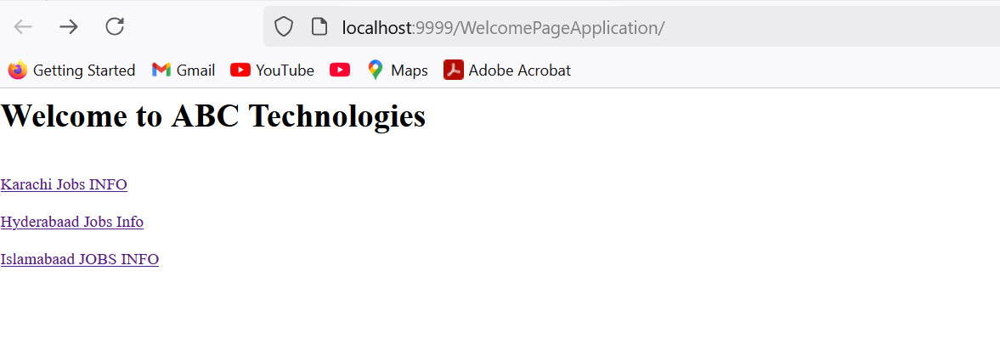

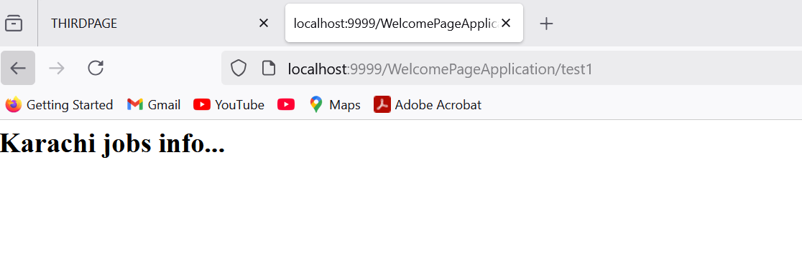


Lecture #10 : Filters and Interceptors in Servlet API
=========================================================================================================================================================================

**Title: Filters and Interceptors in Servlet API**

---

### Overview

Filters/Interceptors are components in a web application used for **PreProcessing and PostProcessing** of requests and responses. They can intercept requests before they reach a Servlet and responses before they are sent back to the client.

---

### Areas of Application

* Logging
* Security
* Altering request information
* Compressing response
* Encrypting response
* Authentication

---

### Filter API (Introduced in Servlet 2.3)

**Main Interfaces:**

1. `Filter`
2. `FilterConfig`
3. `FilterChain`

To create a custom filter, implement the `Filter` interface:

```java
public interface Filter {
    public void init(FilterConfig config) throws ServletException;
    public void doFilter(ServletRequest request, ServletResponse response, FilterChain chain)
            throws IOException, ServletException;
    public void destroy();
}
```

---

### Behind the Scenes

1. When a request is made to a Servlet, the WebContainer checks if any filter is configured.
2. If a filter exists, the request is passed to the filter first.
3. After filter logic is applied, the request goes to the target Servlet.
4. The Servlet processes the request and sends the response back to the filter.
5. The filter may perform post-processing before sending the final response to the browser.

**Example Output Flow:**

```
This line is added by DemoFilter before processing the request...
This is Target Servlet...
This line is added by DemoFilter after processing the request...
```

---

### Filter Mapping

#### Mapping to a Specific URL Pattern

```xml
<filter-mapping>
    <filter-name>DemoFilter</filter-name>
    <url-pattern>/test</url-pattern>
</filter-mapping>
```

#### Mapping to Entire Web Application

```xml
<filter-mapping>
    <filter-name>DemoFilter</filter-name>
    <url-pattern>/*</url-pattern>
</filter-mapping>
```

---

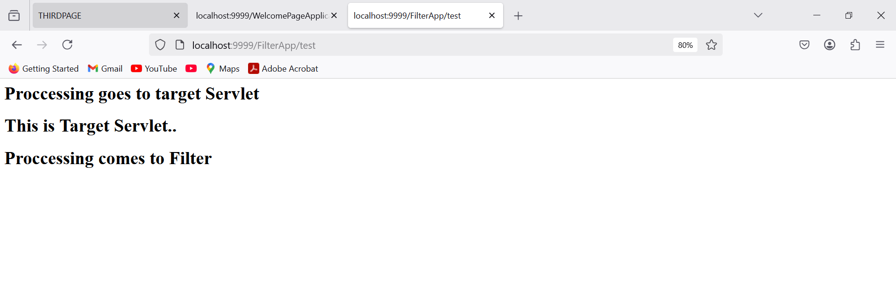


### Filter Chaining

Used to divide request processing across multiple filters.

**Note:**

* Order of execution in FilterChain is container-dependent and not predictable by the user.

---

### Difference: Filter doFilter() vs. FilterChain doFilter()

| Method                   | Description                                                                       |
| ------------------------ | --------------------------------------------------------------------------------- |
| `Filter.doFilter()`      | Callback method called by the container. Executes filtering logic (pre and post). |
| `FilterChain.doFilter()` | Manually called to forward the request to next filter or servlet. Not a callback. |

---
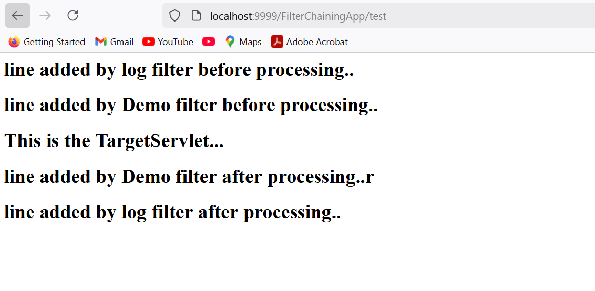


### Wrappers and Listeners

Used to alter `request` and `response` objects inside filters.

#### Examples:

* Convert a resume from Word to PDF during upload.
* Compress a response before sending it to the client.

#### Types of Wrappers:

* Request Wrappers
* Response Wrappers

**Notes:**

* No configuration is needed for wrappers.
* Annotation for filters:

```java
@WebFilter(urlPatterns={"/yourPattern"})
```

---


